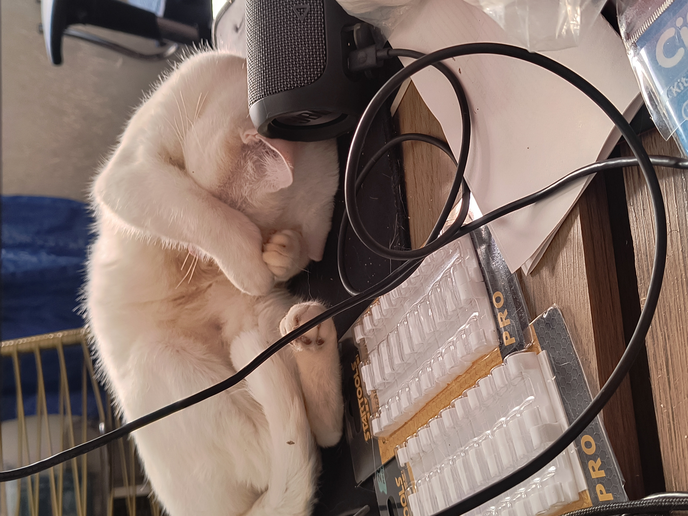
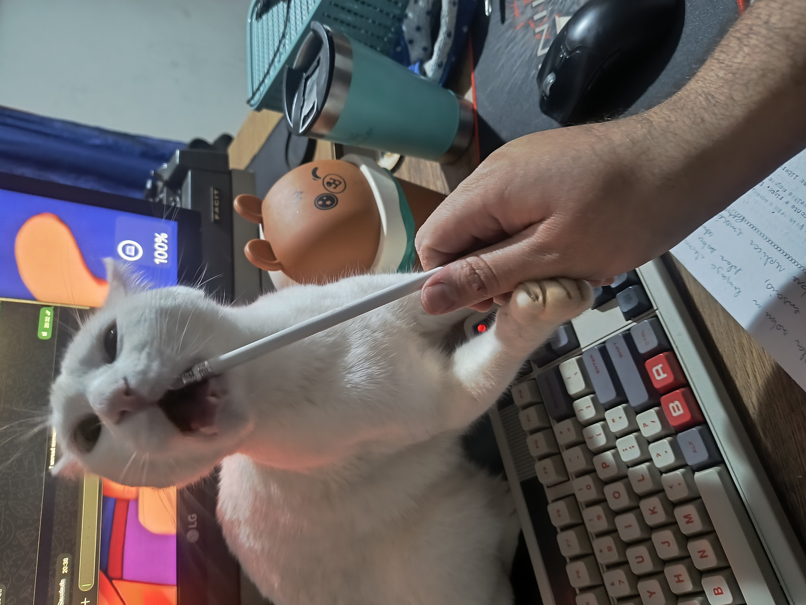

# Tá bom, Senhor Segurança. **Mas o que isso significa?**

Fiquem confortáveis!  
Vocês caíram na minha carta armadilha!  
Essa talk na verdade é sobre **linguística**.

<!--
This is a **note**
-->

---
transition: slide-up
theme: the-unnamed
layout: cover
background: ./assets/slide-00-bg.png
---

# **Quem sou eu?**

---
transition: fade-in
layout: about-me

helloMsg: Olá seres da quinta dimensão!
name: Nilton Frederico
imageSrc: ./assets/slide-02-bg.png
position: left
job: Python Specialist @ Juntos Somos Mais
---

---
transition: slide-up
layout: about-me-curiosities

imageSrc: ./assets/slide-02-bg.png
position: left
line1:
line2:
---

<v-click>- Sou de Ribeirão Preto, aqui em São Paulo!
  - <small>Minha primeira Python Brasil foi lá em 2019!</small></v-click>
<v-click>- Sou o sexto Nilton da minha família!</v-click>
<v-click>- Já publiquei um quadrinho!</v-click>
<v-click>- Tenho dois diabretes, digo, gatas! Connie e Luz!</v-click>
<v-click>- Programador desde 2009, Pythonista desde 2014!</v-click>

---
transition: slide-up
layout: cover
background: ./assets/slide-00-bg.png
---

# Cat Tax em 3<v-click>, 2</v-click><v-click>, 1</v-click>...

---
transition: slide-up
layout: two-cols
---

::right::

---
transition: fade-in
layout: about-me-social

linkedin: https://www.linkedin.com/in/nilton-teixeira/
github: https://github.com/niltonfrederico/
telegram: https://t.me/kuresto
bluesky: https://bsky.app/profile/kuresto.bsky.social
---

---
transition: slide-up
layout: about-me-social
highlight_telegram: true

linkedin: https://www.linkedin.com/in/nilton-teixeira/
github: https://github.com/niltonfrederico/
telegram: https://t.me/kuresto
bluesky: https://bsky.app/profile/kuresto.bsky.social
---
